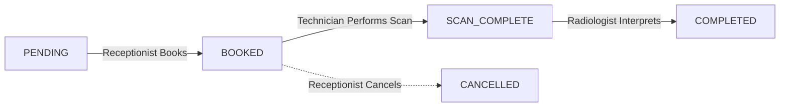
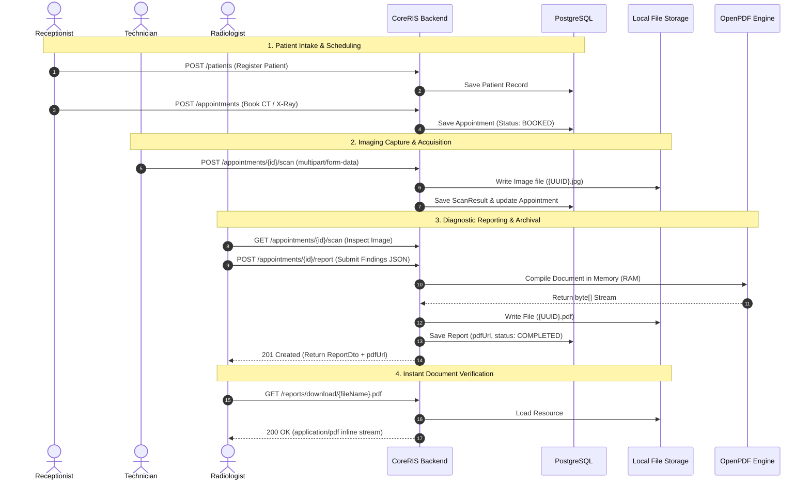

# CoreRIS: Radiology Information System


**CoreRIS** is a production-oriented, enterprise-grade **Radiology Information System (RIS)** built with a **Java 25 + Spring Boot 4** backend and a modern **React 19 + TypeScript + Vite + Tailwind CSS** frontend. 

It manages the complete clinical lifecycle of radiology workflows—from patient intake, scan scheduling, and high-resolution imaging uploads to side-by-side diagnostic interpretation, automated OpenPDF report generation, and role-based staff provisioning.

---

## 📑 Table of Contents

1. [Architecture Overview](#-architecture-overview)
2. [Clinical Workflow & State Machine](#-clinical-workflow--state-machine)
3. [Key Technical Capabilities](#-key-technical-capabilities)
   - [Automated OpenPDF Diagnostic Engine](#1-automated-openpdf-diagnostic-reporting-engine)
   - [Physical Scan Image Storage Engine](#2-physical-scan-image-storage-engine)
   - [Security & Role-Based Access Control (RBAC)](#3-stateless-security--role-based-access-control)
   - [Modern React + Vite Frontend](#4-modern-react--vite-frontend)
   - [Auditing & Enterprise Logging](#5-hipaa-style-auditing--structured-logging)
4. [Role Permissions Matrix](#-role-permissions-matrix)
5. [Pre-Seeded Test Credentials](#-pre-seeded-test-credentials)
6. [Complete REST API Reference](#-complete-rest-api-reference)
7. [Directory Structure](#-directory-structure)
8. [Prerequisites & Local Setup](#-prerequisites--local-setup)
   - [1. Database Configuration](#1-configure-postgresql-database)
   - [2. Backend Setup & Run](#2-run-spring-boot-backend)
   - [3. Frontend Setup & Run](#3-run-react--vite-frontend)
9. [Interactive API Testing (Swagger UI)](#-interactive-api-testing-swagger-ui)
10. [Troubleshooting & FAQs](#-troubleshooting--faqs)

---

## 🏛️ Architecture Overview

CoreRIS operates as a cohesive full-stack monorepo:

```
                      ┌────────────────────────────────────────┐
                      │  Browser Client (Desktop & Tablet)     │
                      │  http://localhost:3000 (React + Vite)  │
                      └───────────────────┬────────────────────┘
                                          │  Reverse Proxy (/api)
                                          ▼
                      ┌────────────────────────────────────────┐
                      │  Spring Boot REST API (:8080/api/v1)   │
                      │  - JwtAuthenticationFilter             │
                      │  - RoleHierarchy & Method Security     │
                      │  - Global Exception Handler            │
                      └──────────────┬──────────────────┬──────┘
                                     │                  │
                    JPA / Hibernate  │                  │  Local Disk I/O
                                     ▼                  ▼
                    ┌──────────────────┐      ┌─────────────────────────┐
                    │ PostgreSQL 18    │      │ scans_storage/ Folder   │
                    │ Database         │      │ - Raw X-Ray/CT Images   │
                    │ (ris_db)         │      │ - Generated Reports.pdf │
                    └──────────────────┘      └─────────────────────────┘
```

---

## 🔄 Clinical Workflow & State Machine

Every imaging case advances through a validated state transition:



### Detailed Sequence Diagram



---

## 🚀 Key Technical Capabilities

### 1. Automated OpenPDF Diagnostic Reporting Engine
- **In-Memory Compilation:** Compiles pixel-perfect clinical A4 diagnostic PDF documents in server RAM using `ByteArrayOutputStream` before flushing to disk, preventing orphaned files on failure.
- **Hospital Branding & Header:** Displays clinic identity (`CORERIS RADIOLOGY INFORMATION SYSTEM`), reference IDs, and timestamp metadata in navy Helvetica typography.
- **2-Column Demographic Table:** Formats patient name, medical ID, age/DOB, gender, contact number, and examination modality.
- **Imaging Correlation:** Automatically pulls technician protocol notes from `ScanResult` into the clinical report.
- **Digital Sign-Off:** Watermarks doctor verification (*"Interpreted by: Dr. John Smith"*) or administrator override indicators.
- **Disk Lifecycle Hygiene:** When an existing report is updated (`PUT /appointments/{id}/report`), the previous PDF on disk is deleted before compiling the replacement to prevent storage bloat.
- **Inline Browser Preview:** Served with `Content-Disposition: inline; filename="..."` and whitelisted in Spring Security so doctors and patients can open reports directly in browser tabs.

### 2. Physical Scan Image Storage Engine
- **Multipart Upload Support:** Handles raw imaging files (`.jpg`, `.png`, `.dcm`, `.webp`) via standard HTTP `multipart/form-data`.
- **Path Traversal Shield:** Cleanses incoming filenames and rejects sequence attacks (`..`).
- **Collision-Proof UUIDs:** Generates 128-bit cryptographically unique filenames (`313843d9-1282-411a-85f5-b71825e93cc3.jpg`), preventing naming collisions across patients.
- **Configurable Location:** Root storage directory managed cleanly via `file.upload-dir=scans_storage` in `application.properties`.

### 3. Stateless Security & Role-Based Access Control
- **HMAC-SHA512 JWTs:** Cryptographically signed Bearer tokens verifying identity on every HTTP transaction.
- **Method-Level Security:** Every REST endpoint is locked down using `@PreAuthorize("hasRole('ROLE')")`.
- **Hierarchical Authorization:** Configured `RoleHierarchy` ensures `ROLE_ADMIN` inherits all permissions of `RADIOLOGIST`, `TECHNICIAN`, and `RECEPTIONIST`.
- **Principal Spoofing Prevention:** Controllers inject `@AuthenticationPrincipal User loggedInUser` directly from the authenticated security context instead of accepting user IDs in JSON request bodies, eliminating ID-spoofing attack vectors.
- **Public Direct Previews:** Whitelisted `/api/v1/reports/download/**` and `/api/v1/scans/download/**` routes allow standard browser tabs and `` tags to preview files without requiring custom authorization header injection in the URL bar.

### 4. Modern React + Vite Frontend
- **Enterprise UI:** Designed with Tailwind CSS and `lucide-react` icons using clinical slate dark-mode palette (`#0f172a`, `#1e293b`).
- **Role-Tailored Workspaces:** Navigation dynamically filters tabs according to active staff permissions.
- **1-Click Test Portals:** Login page provides instant single-click autofill for all 4 roles.
- **Side-by-Side Diagnostic Station:** Radiologist view renders technician scan images on the left while providing the diagnosis form on the right.
- **Full Timeline Inspection:** Interactive modal detailing Patient Intake ➔ Scan Capture ➔ Diagnostic PDF report in a single view.
- **Zero-Crash Data Resilience:** Adapts to Spring Data's `Page<T>` responses (`SpringPage<T>`) and guards all data arrays against runtime rendering crashes.
- **Seamless Local Proxy:** Vite development proxy maps `/api` requests to `http://localhost:8080` without requiring backend CORS modifications during local development.

### 5. HIPAA-Style Auditing & Structured Logging
- **Rolling File Appenders:** Logback configuration automatically writes to `logs/coreris-audit.log`, archives daily files (`logs/archived/coreris-%d{yyyy-MM-dd}.log`), and retains 30 days of history.
- **User MDC Tracking:** Every audit log line captures the active logged-in user: `[User: user2]`.
- **Global Error Handling:** `GlobalExceptionHandler` logs full exception stack traces to disk and returns clean, uniform `ErrorResponseDto` payloads to clients.

---

## 🛡️ Role Permissions Matrix

| Feature / Action | Endpoint | Admin | Radiologist | Technician | Receptionist |
| :--- | :--- | :---: | :---: | :---: | :---: |
| **User Authentication** | `POST /auth/login` | ✅ | ✅ | ✅ | ✅ |
| **Register Patient** | `POST /patients` | ✅ | ❌ | ❌ | ✅ |
| **List / View Patients** | `GET /patients/**` | ✅ | ❌ | ❌ | ✅ |
| **Book Appointment** | `POST /appointments` | ✅ | ❌ | ❌ | ✅ |
| **Cancel Appointment** | `PUT /appointments/{id}/cancel` | ✅ | ❌ | ❌ | ✅ |
| **List Appointments** | `GET /appointments` | ✅ | ✅ | ✅ | ✅ |
| **Upload Scan Image** | `POST /appointments/{id}/scan` | ✅ | ❌ | ✅ | ❌ |
| **Update Scan Image** | `PUT /appointments/{id}/scan` | ✅ | ❌ | ✅ | ❌ |
| **Write Diagnostic Report** | `POST /appointments/{id}/report` | ✅ | ✅ | ❌ | ❌ |
| **Update Report & PDF** | `PUT /appointments/{id}/report` | ✅ | ✅ | ❌ | ❌ |
| **Download / Stream PDF** | `GET /reports/download/{file}` | ✅ | ✅ | ✅ | ✅ *(Public)* |
| **Download / Stream Scan** | `GET /scans/download/{file}` | ✅ | ✅ | ✅ | ✅ *(Public)* |
| **Provision Staff Account** | `POST /users` | ✅ | ❌ | ❌ | ❌ |
| **List Staff Accounts** | `GET /users` | ✅ | ❌ | ❌ | ❌ |
| **Delete Staff User** | `DELETE /users/{id}` | ✅ | ❌ | ❌ | ❌ |

---

## 🔑 Pre-Seeded Test Credentials

On fresh startup, `DatabaseSeeder.java` seeds the database with realistic clinical staff, patient histories, and test cases:

| Role | Name | Username | Password | Purpose |
| :--- | :--- | :--- | :--- | :--- |
| **Administrator** | Chintan Patel | `user0` | `password0` | System configuration, staff management, role overrides |
| **Technician** | Jane Tech | `user1` | `password1` | Imaging scan capture, file upload, modality notes |
| **Radiologist** | Dr. John Smith | `user2` | `password2` | Scan inspection, diagnosis, OpenPDF compilation |
| **Receptionist** | Alice Reception | `user3` | `password3` | Patient intake, appointments scheduling & cancellations |

### Pre-Seeded Clinical Cases:
- **Patient #1:** Robert Brown (Blood: O+, CT Scan, Chest X-Ray completed, Diagnostic Report finalized).
- **Patient #2:** Sarah Connor (Blood: AB-, X-Ray Scan, Ultrasound scan image uploaded, **ready for Radiologist reporting**).

---

## 📡 Complete REST API Reference

Base URL: `http://localhost:8080/api/v1`

### Authentication (`/auth`)
| Method | Path | Description | Access |
| :--- | :--- | :--- | :--- |
| `POST` | `/auth/login` | Authenticate user & receive JWT Bearer token | Public |

### Patient Management (`/patients`)
| Method | Path | Description | Access |
| :--- | :--- | :--- | :--- |
| `GET` | `/patients` | Get paginated list of patients (`?page=0&size=10`) | `RECEPTIONIST`, `ADMIN` |
| `GET` | `/patients/{id}` | Get patient details by ID | `RECEPTIONIST`, `ADMIN` |
| `GET` | `/patients/history/{id}` | Get full patient history and past appointments | `RECEPTIONIST`, `ADMIN` |
| `POST` | `/patients` | Register new master patient record | `RECEPTIONIST`, `ADMIN` |
| `PUT` | `/patients/{id}` | Update existing patient demographics | `RECEPTIONIST`, `ADMIN` |
| `DELETE` | `/patients/{id}` | Permanently remove patient record | `RECEPTIONIST`, `ADMIN` |

### Appointments & Worklist (`/appointments`)
| Method | Path | Description | Access |
| :--- | :--- | :--- | :--- |
| `GET` | `/appointments` | List all appointments (filterable by `?status=BOOKED`) | Authenticated |
| `GET` | `/appointments/{id}` | Get appointment details by ID | Authenticated |
| `GET` | `/appointments/history/{id}` | Get case timeline (intake, scan result, report) | Authenticated |
| `POST` | `/appointments` | Book new imaging appointment | `RECEPTIONIST`, `ADMIN` |
| `PUT` | `/appointments/{id}` | Update appointment schedule or scan type | `RECEPTIONIST`, `ADMIN` |
| `PUT` | `/appointments/{id}/cancel` | Cancel an active appointment | `RECEPTIONIST`, `ADMIN` |

### Imaging & Scan Results (`/scans` & `/appointments`)
| Method | Path | Description | Access |
| :--- | :--- | :--- | :--- |
| `POST` | `/appointments/{id}/scan` | Upload scan image (`file`) & details (`multipart/form-data`) | `TECHNICIAN`, `ADMIN` |
| `GET` | `/appointments/{id}/scan` | Fetch scan result for an appointment | Authenticated |
| `PUT` | `/appointments/{id}/scan` | Replace/update scan result file and details | `TECHNICIAN`, `ADMIN` |
| `GET` | `/scans/download/{fileName}` | Stream/render raw scan image directly | Public |

### Diagnostic Reports & OpenPDF (`/reports` & `/appointments`)
| Method | Path | Description | Access |
| :--- | :--- | :--- | :--- |
| `POST` | `/appointments/{id}/report` | Formulate finding, compile & save OpenPDF document | `RADIOLOGIST`, `ADMIN` |
| `GET` | `/appointments/{id}/report` | Get diagnostic report details and PDF URL | Authenticated |
| `PUT` | `/appointments/{id}/report` | Update findings, delete old PDF, compile new PDF | `RADIOLOGIST`, `ADMIN` |
| `GET` | `/reports/download/{fileName}`| Stream/render archival clinical PDF in browser | Public |

### Staff Management (`/users`, `/radiologists`, `/technicians`, `/receptionists`)
| Method | Path | Description | Access |
| :--- | :--- | :--- | :--- |
| `GET` | `/users` | Get all system user accounts | `ADMIN` |
| `POST` | `/users` | Provision new staff account (`UserDto`) | `ADMIN` |
| `GET` | `/users/{id}` | Get user details by ID | Authenticated |
| `DELETE` | `/users/{id}` | Delete user account | `ADMIN` |
| `GET` | `/radiologists` | List all active radiologist profiles | Authenticated |
| `GET` | `/technicians` | List all active technician profiles | Authenticated |
| `GET` | `/receptionists` | List all active receptionist profiles | Authenticated |

---

## 📂 Directory Structure

```
coreris/
├── coreris/                              # Spring Boot Backend Project
│   ├── pom.xml                           # Maven dependencies (Java 25, Spring Boot 4, OpenPDF)
│   ├── src/
│   │   ├── main/
│   │   │   ├── java/com/example/coreris/
│   │   │   │   ├── config/               # AppConfig (ModelMapper, Beans)
│   │   │   │   ├── controller/           # REST API Controllers (Patient, Appointment, Scan, Report, User)
│   │   │   │   ├── dto/                  # DTOs & Validation constraints
│   │   │   │   ├── entity/               # JPA Entities & Enums (ScanType, StatusType, RoleType)
│   │   │   │   ├── exception_handler/    # GlobalExceptionHandler & Custom Exceptions
│   │   │   │   ├── repository/           # Spring Data JPA Repositories
│   │   │   │   ├── security/             # Spring Security, JWT Filter, OpenApiConfig
│   │   │   │   ├── seeder/               # DatabaseSeeder (pre-loaded demo data)
│   │   │   │   └── service/              # Core Business Logic
│   │   │   │       ├── impl/             # LocalFileStorageServiceImpl (Disk I/O)
│   │   │   │       ├── FileStorageService.java
│   │   │   │       ├── PdfGeneratorService.java  # OpenPDF in-memory document builder
│   │   │   │       ├── ReportService.java        # PDF & Report lifecycle manager
│   │   │   │       └── ...
│   │   │   └── resources/
│   │   │       ├── application.properties # Server port, DB config, /api/v1 context-path
│   │   │       └── logback-spring.xml     # Daily rolling file audit appenders
│   │   └── test/                         # Unit & Integration Tests
│   └── logs/                             # Audit log files (coreris-audit.log)
├── frontend/                             # React + Vite Frontend Project
│   ├── package.json                      # React 19, TypeScript 6, Tailwind CSS, Lucide
│   ├── vite.config.ts                    # Port 3000 & /api reverse proxy configuration
│   ├── tailwind.config.js                # Clinical slate & brand color definitions
│   ├── index.html                        # Application HTML shell
│   └── src/
│       ├── api/                          # Modular API clients (Axios instance, interceptors, types)
│       │   ├── client.ts                 # Base Axios setup with Bearer injection
│       │   ├── types.ts                  # TypeScript DTO interfaces & SpringPage<T>
│       │   ├── authService.ts            # Login & session storage
│       │   ├── patientService.ts         # Patient CRUD & history
│       │   ├── appointmentService.ts     # Appointment booking & status
│       │   ├── scanService.ts            # Multipart file uploads & preview URLs
│       │   ├── reportService.ts          # Report generation & PDF URL resolver
│       │   └── userService.ts            # Staff management
│       ├── context/
│       │   ├── AuthContext.tsx           # Authentication state & role checks
│       │   └── ToastContext.tsx          # Floating animated toast alerts
│       ├── components/
│       │   ├── common/                   # Navbar, Sidebar, Modal, ConfirmDialog, Skeletons
│       │   └── layout/                   # AppLayout, ProtectedRoute (RBAC Guard)
│       └── pages/
│           ├── LoginPage.tsx             # Clinical sign-in with 1-click test role portals
│           ├── DashboardPage.tsx         # Live KPI metrics & recent cases
│           ├── PatientsPage.tsx          # Patient directory & registration
│           ├── AppointmentsPage.tsx      # Scheduling & interactive case timeline
│           ├── TechnicianQueuePage.tsx   # Imaging capture & upload worklist
│           ├── RadiologistQueuePage.tsx  # Side-by-side scan & diagnostic PDF generator
│           ├── UsersPage.tsx             # Administrator staff management
│           └── NotFoundPage.tsx          # 404 handler
├── scans_storage/                        # Uploaded scans and compiled PDF files
└── README.md                             # Comprehensive project manual
```

---

## 🛠️ Prerequisites & Local Setup

Ensure the following tools are installed:
1. **Java SDK 25** (Oracle OpenJDK or Eclipse Temurin)
2. **PostgreSQL 16+** (default local port `5432`)
3. **Node.js 20+** and **npm**
4. **Maven** (or use the provided `mvnw` wrapper)

---

### 1. Configure PostgreSQL Database

Open `psql` or pgAdmin and create the database:
```sql
CREATE DATABASE ris_db;
```

---

### 2. Run Spring Boot Backend

1. Navigate to the backend directory:
   ```bash
   cd coreris
   ```

2. Review `src/main/resources/application.properties` to ensure credentials match your local PostgreSQL:
   ```properties
   spring.datasource.url=jdbc:postgresql://localhost:5432/ris_db?options=-c timezone=Asia/Kolkata
   spring.datasource.username=postgres
   spring.datasource.password=postgres
   server.servlet.context-path=/api/v1
   file.upload-dir=scans_storage
   ```

3. Build and launch:
   ```bash
   mvn clean compile
   mvn spring-boot:run
   ```

Once the terminal prints `Started CorerisApplication in X seconds`, the backend is active at **`http://localhost:8080/api/v1`**.

---

### 3. Run React + Vite Frontend

1. Open a second terminal window and navigate to `frontend`:
   ```bash
   cd frontend
   ```

2. Install dependencies:
   ```bash
   npm install
   ```

3. Start the Vite development server:
   ```bash
   npm run dev
   ```

4. Open your browser at **`http://localhost:3000`**!

---

## 🌐 Interactive API Testing (Swagger UI)

SpringDoc OpenAPI 3.0 provides a built-in interactive console for testing backend endpoints:

### Access Swagger Console:
👉 **`http://localhost:8080/api/v1/swagger-ui/index.html`**

### Authenticating in Swagger:
1. Expand **`auth-controller`** ➔ `POST /auth/login`.
2. Click **Try it out** and enter test credentials:
   ```json
   {
     "username": "user2",
     "password": "password2"
   }
   ```
3. Click **Execute** and copy the returned `token` string.
4. Scroll to the top of the Swagger page and click the green **Authorize 🔒** button.
5. In the `Value` box, paste the token and click **Authorize**.
6. All secured endpoints (e.g. `POST /appointments/{id}/report`) are now authorized!

---

## 🩺 End-to-End Workflow Testing Guide

You can test the entire hospital workflow using the React frontend at **`http://localhost:3000`**:

1. **Patient Intake (Receptionist):**
   - Click the **"Receptionist"** quick button on the login screen (`user3` / `password3`).
   - Navigate to **Patients** ➔ Click **"Register Patient"** (e.g. "Bruce Wayne", O+, 1980-05-19).
   - Navigate to **Appointments** ➔ Click **"Book Appointment"** for your patient (Modality: `MRI_SCAN`).
2. **Image Capture (Technician):**
   - Sign out and click **"Technician"** (`user1` / `password1`).
   - Navigate to **Scan Worklist** ➔ Find the new appointment with status *Ready for Scan*.
   - Click **"Upload Scan"** ➔ Drag & drop an imaging sample, enter acquisition notes, and click **"Save Scan Result"**.
3. **Diagnostic Report & PDF Generation (Radiologist):**
   - Sign out and click **"Radiologist"** (`user2` / `password2`).
   - Navigate to **Diagnostic Reports** ➔ Click **"Write Report"** on the completed scan.
   - Review the technician's scan image on the left, type clinical findings on the right, and click **"Finalize & Generate PDF"**.
   - Your browser will automatically open and render the archival clinical PDF report complete with hospital banner, demographic table, and doctor sign-off!
4. **Staff Management (Administrator):**
   - Sign out and click **"Administrator"** (`user0` / `password0`).
   - Navigate to **Staff Management** ➔ Click **"Provision Staff User"** to register new staff accounts with immediate role enforcement.

---

## ❓ Troubleshooting & FAQs

#### Q: The browser shows `HTTP ERROR 403` when opening a report link.
**Solution:** Ensure you are using the updated download route (`/api/v1/reports/download/{fileName}`), which is whitelisted in `SecurityConfig.java` to allow direct in-browser rendering without requiring custom HTTP header injection in the browser URL bar.

#### Q: The frontend says `Network Error` or fails to connect during login.
**Solution:** Ensure the Spring Boot backend is actively running on port `8080`. You can test connection to the port in PowerShell:
```powershell
Test-NetConnection -ComputerName localhost -Port 8080
```

#### Q: Where are uploaded scans and PDF files stored?
**Solution:** Physical files are stored in the root `scans_storage/` directory on your hard drive with collision-proof UUID filenames (e.g. `scans_storage/313843d9-1282-411a-85f5-b71825e93cc3.pdf`).

---

## 📄 License
This project is open-source.
